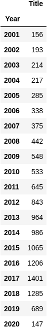
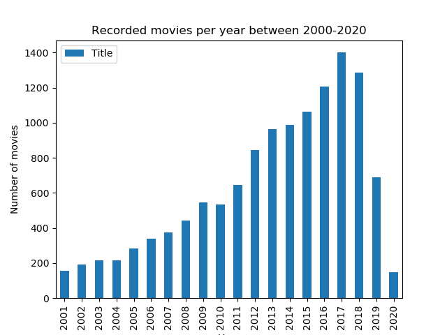
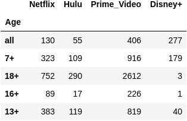
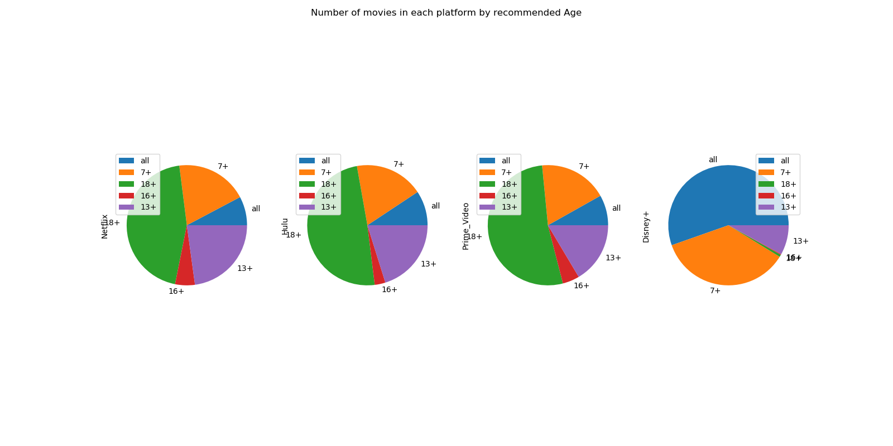

# MOVIES DATASET AND REVIEWS APIS-PROJECT

## Resume

This project aims to find out information about over 16000 movies, completing their information with the New York Times Movies Reviews API.
The project is developed in Python, and the main script (main.py) is thought to be runned from the terminal.

## Resources
For this project, the following datasets have been used. Specially thanks to their contributors for spreading so rich information about this subject:

* **Movies on Netflix, Prime Video, Hulu and Disney+**--> https://www.kaggle.com/ruchi798/movies-on-netflix-prime-video-hulu-and-disney 

This dataset contains over 16000 movies and its appearance on different streamming platforms.

* **New York Times Movie Reviews API**--> https://developer.nytimes.com/docs/movie-reviews-api

This API contains every movie review published in the New York Times newspaper.

## Structure

1) README.txt: As a resume for the content of the project an its development

2) main.py: It contains the main script for the project, to be executed from the terminal

3) data_cleaning.ipynb: Jupyer Notebook file that imports the movies dataset and its cleaning up

4) API_movies.ipynb: Jupyer Notebook file that contains the main script for 

6) src: It contains relevant files so that the code can be runned. These are .py files

7) output: It contains the extracted information from the code. For this project, graphs and a report in PDF have been taken out

8) zz_trash: It contains dismissed analysis

## Project development

First of all, the movies dataset has been cleaned by means of outter functions in .py files. This job has been carried out in data_cleaning.ipynb

Afterwards, data from the NY Times API has been loaded and transform into a dataFrame, applying the cleaning operations as well.

From there on, the script filters by keyboard arguments and merges both dataframes, offering to open the url for the review of a selected movie in the merged dataframe.

At last, a gloabl report is developed as PDF file, and sent by mail.

## Conclusions

- The next table summarizes the movies recorded every year from 2001-2020

- Expressed as a bar plot in the following figure:

- The next table summarizes the amount of movies per recommended age in each platform:

  

- Expressed as a pie plot in the following figure:

   